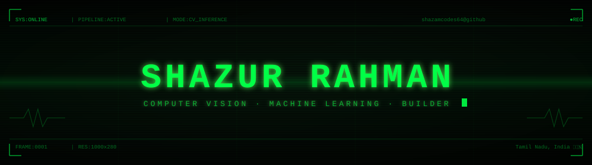

<div align="center">



<br/>

[](https://git.io/typing-svg)

<br/>

[](https://www.linkedin.com/in/shazur-rahman/)
[](mailto:shazurrahman2007@gmail.com)
[](https://github.com/shazamcodes64)
[](https://github.com/shazamcodes64)

</div>


```
╔══════════════════════════════════════════╗
║  PIPELINE  ›  INIT → PROCESS → TRANSMIT  ║
╚══════════════════════════════════════════╝
```

### `[ INIT ]` — whoami

```python
class ShazurRahman:
    def __init__(self):
        self.role       = "CSE (Computational Intelligence) undergrad · ML/CV Builder"
        self.location   = "Tamil Nadu, India 🇮🇳"
        self.stack      = ["Python", "Flutter", "FastAPI", "OpenCV", "PyTorch"]
        self.building   = "Gaze Tracking System — real-time eye tracking & attention heatmaps"
        self.exploring  = ["Explainable AI", "Autonomous systems", "Applied ML research"]
        self.philosophy = "Ship the demo. Iterate from there."

    def collaborate_on(self):
        return ["computer vision", "applied ML", "autonomous systems"]
```


### `[ LOAD ]` — Toolbox

**`ML / CV`**


**`WEB / APP`**


**`PLATFORM`**


### `[ PROCESS ]` — Currently Building

```
  >> ACTIVE_JOB: Gaze Tracking System
  >> STATUS    : IN_PROGRESS
  >> ETA       : shipping soon
```

> 🎯 **[Gaze Tracking System](#)** — real-time eye-tracking and attention-heatmap platform with a mobile-friendly clinician login flow. Combines OpenCV face/eye landmarks with a React analytics dashboard for session-level insights.


### `[ OUTPUT ]` — Selected Work

```
  >> SCANNING REPO... 5 objects detected.
```

| `#` | Project | Stack | Description |
|---|---|---|---|
| `01` | 👁️ **Gaze Tracking System** | Python · OpenCV · React | Real-time eye tracking with session-based attention heatmaps. |
| `02` | 🅿️ **AAPS — Autonomous AI Parking** | Flutter · FastAPI · PostgreSQL | AI-driven parking system with full SRS/TDD spec and sprint backlog. |
| `03` | 🏔️ **Landslide Susceptibility (IGC 2026)** | Python · ML | Comparative ML framework for landslide susceptibility. Provisionally accepted at IGC 2026. |
| `04` | 🌄 **Explainable AI Smart Tourism** | Python · GBM/LSTM · SHAP | UROP research — visitor demand prediction with SHAP explainability. |
| `05` | 🎮 **Nova Drift — Web Game Portal** | Three.js · JavaScript | 3D endless dodge game with a game-hub portal interface. |


### `[ METRICS ]` — GitHub in Numbers

<div align="center">


&nbsp;


</div>


### `[ RENDER ]` — Computer Vision HUD


### `[ LOG ]` — Quote I'm Coding By

<div align="center">

```
  ┌─────────────────────────────────────────────────────────────────────┐
  │                                                                     │
  │   "If you start removing things, if you get to the point where      │
  │    if you were to remove anything more it would not work any        │
  │    more — at this point it is beautiful."                           │
  │                                                                     │
  │                                       — Joe Armstrong (programmer)  │
  │                                                                     │
  └─────────────────────────────────────────────────────────────────────┘
```

</div>


### `[ TRANSMIT ]` — Let's build something

<div align="center">

[](https://www.linkedin.com/in/shazur-rahman/)
[](mailto:shazurrahman2007@gmail.com)
[](https://github.com/shazamcodes64)

<br/>

```
  ⭐  If a project caught your eye, a star goes a long way.
  ──────────────────────────────────────────────────────
  >> END_OF_TRANSMISSION
```

</div>
