<div align="center">


<br>

[](https://www.linkedin.com/in/shazur-rahman/)
[](mailto:shazurrahman2007@gmail.com)
[](https://github.com/shazamcodes64)


</div>

---

### ⚡ whoami

```python
class ShazurRahman:
    def __init__(self):
        self.role       = "CSE (Computational Intelligence) undergrad · ML/CV Builder"
        self.location   = "Tamil Nadu, India 🇮🇳"
        self.stack      = ["Python", "Flutter", "FastAPI", "OpenCV", "PyTorch"]
        self.building   = "Gaze Tracking System — real-time eye tracking & attention heatmaps"
        self.exploring  = ["Explainable AI", "Autonomous systems", "Applied ML research"]
        self.philosophy = "Ship the demo. Iterate from there."

    def collaborate_on(self):
        return ["computer vision", "applied ML", "autonomous systems"]
```

---

### 🧰 Toolbox

**🤖 ML / CV**


**🌐 Web / App**


**⚙️ Platform**


---

### 🚧 Currently Building

🎯 **[Gaze Tracking System](#)** — a real-time eye-tracking and attention-heatmap platform. Combines OpenCV face/eye landmark detection with session-level attention heatmaps for analytics.

---

### 📂 Selected Work

| Project | Stack | Description |
|---|---|---|
| 👁️ **Gaze Tracking System** | Python · OpenCV | Real-time eye tracking with session-based attention heatmaps. |
| 🅿️ **AAPS — Autonomous AI Parking System** | Flutter · FastAPI · PostgreSQL | Driver-facing app for an AI-driven autonomous parking system, with full SRS/TDD/UI-UX spec and sprint-planned backlog. |
| 🏔️ **Landslide Susceptibility Prediction (IGC 2026)** | Python · ML | Comparative ML framework (Logistic Regression, SVM, Random Forest, XGBoost) for landslide susceptibility. Provisionally accepted at IGC 2026. |
| 🌄 **Explainable AI Smart Tourism System** | Python · GBM/LSTM · SHAP | UROP research — visitor demand prediction and recommendation for tourism, with explainability via SHAP. |
| 🎮 **Nova Drift — Web Game Portal** | Three.js · JavaScript | 3D endless dodge game built for a web dev induction task, with a game-hub portal interface. |

---

### 📊 GitHub in Numbers

<div align="center">


</div>

---

### 🖥️ Computer Vision HUD Contribution Grid



---

### 💭 Quote I'm Coding By

> *"Compatibility means deliberately repeating other people's mistakes."*  
> — David Wheeler (computer scientist)

---

### 🤝 Let's build something

<div align="center">

[](https://www.linkedin.com/in/shazur-rahman/)
[](mailto:shazurrahman2007@gmail.com)
[](https://github.com/shazamcodes64)

⭐ If a project caught your eye, a star goes a long way.


</div>
